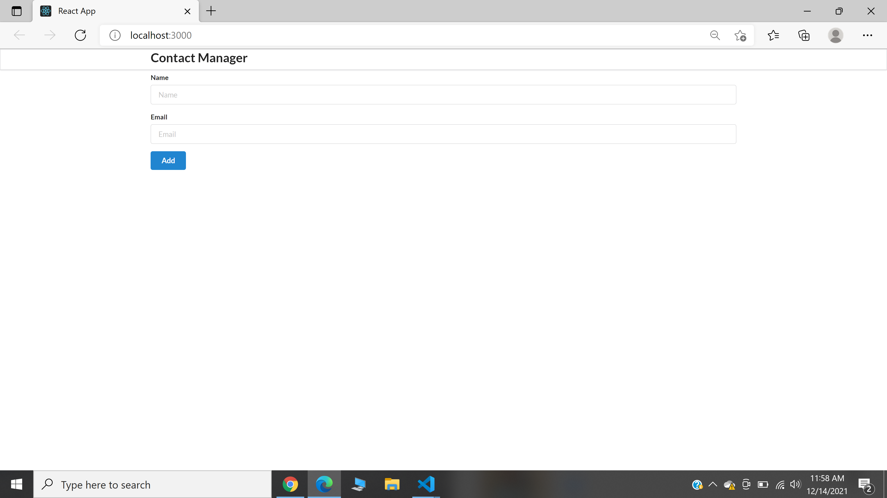
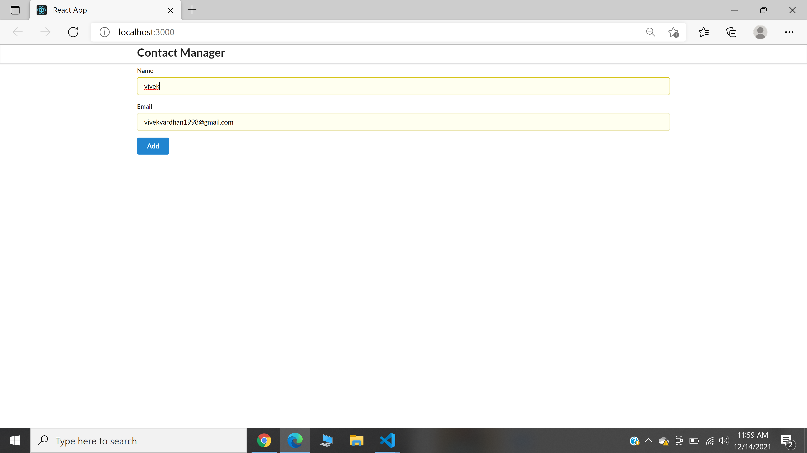
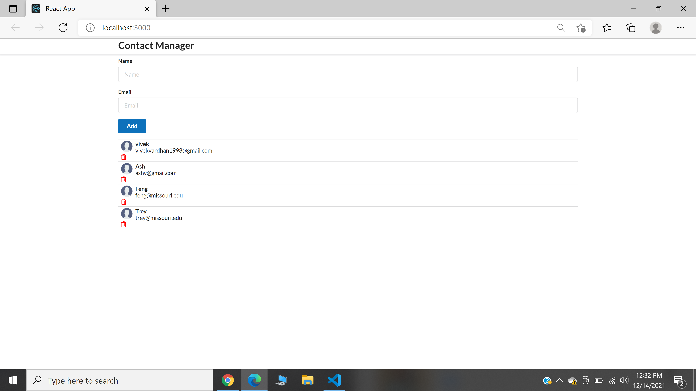
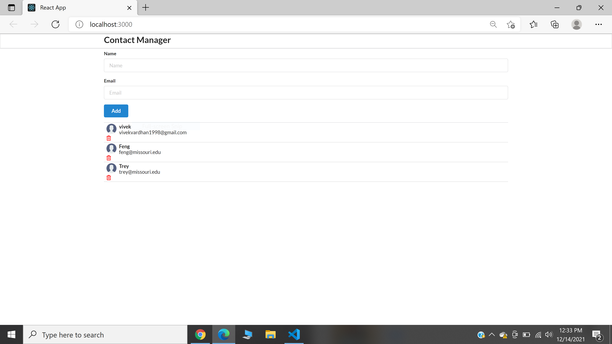

# Exploration4: Industry Preparation
        Name : Vivek Vardhan Reddy Thipparthi
        pawprint : vtqnr
==================================================================================================

As part of the Exploration4, ReactJS is widely in talk in the Industry and can be seen in almost all the job requirements. This is my very first React application, I started to learn it from the scratch and developed a basic application called Contact Manager where we can save the contacts in the application and can delete them with delete button in the application. As it my first application in React I explored plenty of things like starting an application in React, Rendering and DOM properties in React, Application flow in React etc

Link to the Application : [vivekvardhanreddy.me](https://www.vivekvardhanreddy.me/exp4/)

## Contact Manager

Here we could see the application Contact Manager with two input fields for name and email and a button to add them

&nbsp;

Entering the Inputs

&nbsp;

Here we could see the data entered is displayed in the application

&nbsp;

Some data is entered and now a data entry is deleted using the delete button

&nbsp;

The contact 'Ash' is deleted from the list

